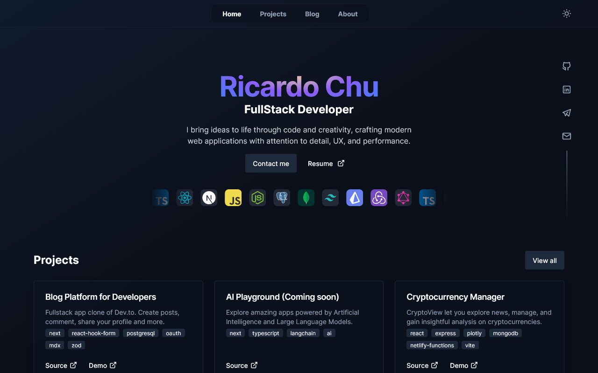
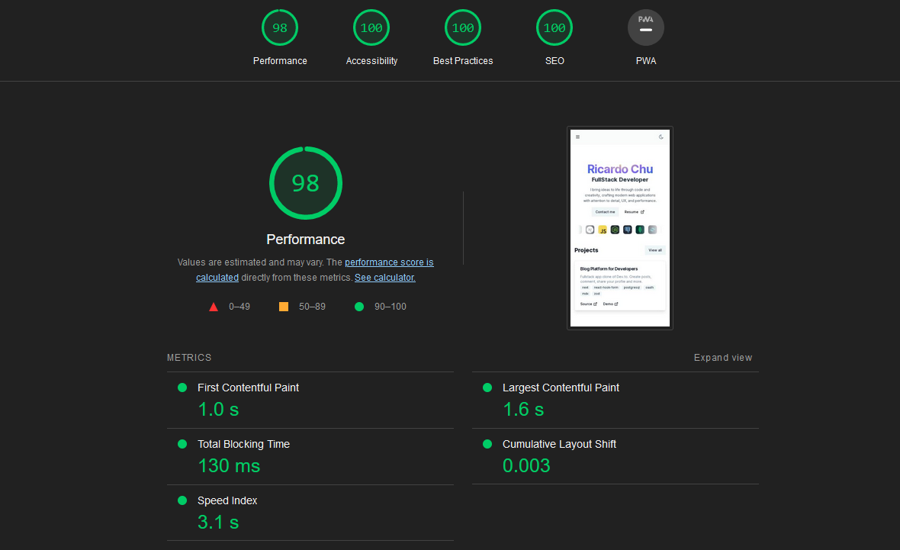

# Personal Portfolio

Portfolio and blog built with TypeScript, Next 13and TailwindCSS.



Live demo: [https://www.ricardochu.com](https://www.ricardochu.com/)

## Features

* Performance and SEO optimized 
* Toggle light/dark theme
* SSR pages
* SSG blog posts
* Beautiful animations
* Direct email contact
* Vercel analytics

## Lighthouse score

Lighhouse score > 95/100 for mobile and desktop. Excellent score for performance, accessibility and SEO. 



## Running the project

Clone this repository to your local machine, install dependencies and run development mode:

```sh
git clone https://github.com/kypexfly/ricardochu.com.git
cd ricardochu.com
npm install
npm run dev
```
Open [http://localhost:3000](http://localhost:3000) and start writing your code.

## Environment variables

```sh
RESEND_API_KEY=Resend API key is required to use the contact form
NEXT_PUBLIC_CV_URL=URL of your resume/cv (GDrive, direct link, etc.)
```

## Technologies

* TypeScript
* Next.js 13 with App Router
* TailwindCSS
* Shadcn
* Framer Motion
* Resend
* Contentlayer
* MDX
* Zod

## Deployment

This project was deployed on Vercel with Vercel Analytics for real time analysis.

## Credits

* Inter font by [Rasmus Andersson](https://rsms.me)
* Card Spotlight by [ibelick](https://ui.ibelick.com/card-spotlight)
* Form button by [DevDojo](https://devdojo.com/tailwindcss/buttons)
* README format by [InfVlad](https://github.com/InfVlad/Portfolio)
* Design inspiration: [Tania Rascia](https://www.taniarascia.com)